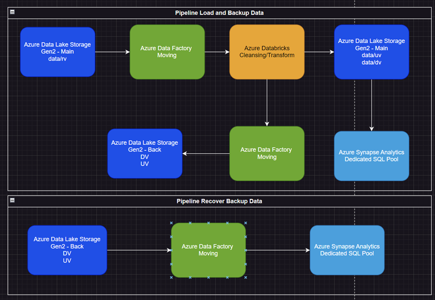

# globant-challenge
This is my repo for globant challenge opportunity

## Objectives
Design a PoC for challenge #1 of Globant challenge 2023.
Implement PoC with Azure technologies and show the results.
## Requirements
Move historic data from files in CSV format to the new database.
Create a Rest API service to receive new data. This service must have:
    Each new transaction must fit the data dictionary rules.
    Be able to insert batch transactions (1 up to 1000 rows) with one request.
    Receive the data for each table in the same service.
    Keep in mind the data rules for each table.
Create a feature to backup for each table and save it in the file system in AVRO format.
Create a feature to restore a certain table with its backup.

## Arquitecture

## Proof of Functionality
### Load Files in ADLS Main
ADLS gen2 is deployed to store csv files.
RV: Raw Vault
UV: Universal Vault
DV: Dimensional Vault

### ADLS Backup 
ADLS Gen 2 deployed for backup files and tables' data

### Azure Synapse for SQL database
Dedicated SQL Pool is deployed to query data

### Azure Data factory
Datafactory is used for move data from RV to UV or DV, depends on data's origin
Also is required for execute databricks notebooks

### Azure Databricks
Databricks notebooks is required for transform data and load them into another path such as UV or DV
